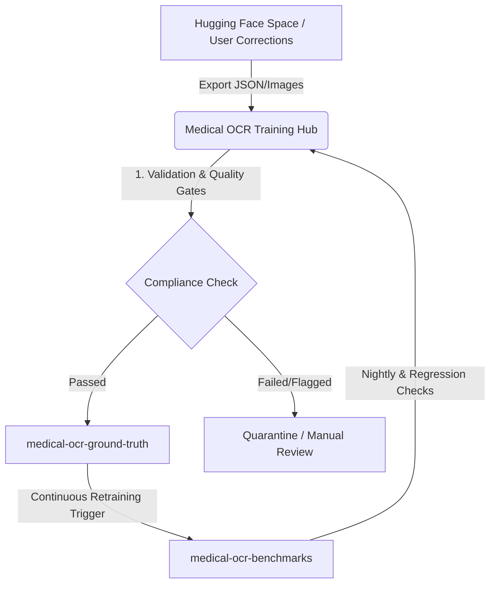

# Medical OCR Training Hub

Welcome to the **Medical OCR Training Hub**. This repository serves as the vital strategic bridge within the `Omni-Medical-Suite` ecosystem. It automates the continuous data loop between user-assisted corrections on Hugging Face Spaces and our production-ready training datasets on GitHub.

---

## 🗺️ The Architecture & Data Loop

This hub orchestrates a continuous feedback loop to ensure our Medical OCR models improve over time based on real-world corrections.



### How the Bridging Loop Works

1. **Inbound from HF:** Corrections made by users or annotators on the Hugging Face correction Space are packaged (JSON metadata + scanned images).
2. **Ingestion & Validation:** This hub ingests the packets, runs schema validation, and ensures adherence to our DATASETS_POLICY.md.
3. **Ground Truth Enrichment:** Verified data is automatically pushed into the `medical-ocr-ground-truth` repository as the Single Source of Truth (SSOT).
4. **Benchmark Verification:** The updated ground truth triggers nightly regression benchmarks to guarantee that retrained models maintain high baseline accuracy.

---

## 🛠️ Repository Structure

```
medical-ocr-training-hub/
├── src/
│   └── ingestion/
│       └── ingest_and_clean.py   # Data ingestion, validation & PII scrubbing
├── config.yaml                    # Pipeline configuration
├── setup.sh                       # Environment setup
├── training_data/                 # Local training data staging
├── docs/                          # Documentation
├── models/                        # Model artifacts
├── scripts/                       # Utility scripts
└── README.md
```

---

## 🔒 Governance & Security

Because this pipeline processes medical text and handwriting documents, strict data governance is applied:

- All inbound data must strip potential PII (Personally Identifiable Information) before hitting the public ground truth layers.
- Contribution validation thresholds must meet a minimum confidence score defined in our nightly benchmarks.
- Part of the [Omni-Medical-Suite](https://github.com/DrAbdulmalek/omni-medical-suite) ecosystem.

---

## 🚀 Quick Start

```bash
# Clone the repository
git clone https://github.com/DrAbdulmalek/medical-ocr-training-hub.git
cd medical-ocr-training-hub

# Install dependencies
pip install requests

# Run the ingestion pipeline (dry-run with mock data)
python src/ingestion/ingest_and_clean.py
```

---

## 📥 Data Flow

| Stage | Input | Output | Validation |
|-------|-------|--------|------------|
| **Ingestion** | HF Space corrections (JSON + images) | Raw data packets | Schema check |
| **PII Scrubbing** | Raw text fields | Redacted text | Regex patterns (phones, dates, names) |
| **Quality Gate** | Scrubbed packets | Clean data | Minimum text length, required fields |
| **Ground Truth** | Clean data | Verified datasets | DATASETS_POLICY.md compliance |

---

## 📄 License

MIT License — Part of the Omni-Medical-Suite ecosystem by [DrAbdulmalek](https://github.com/DrAbdulmalek).