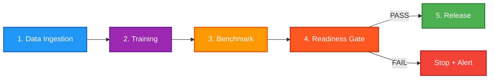

# Release Pipeline — medical-ocr-training-hub

## Overview

This document describes the automated release pipeline for the OmniMedical OCR training system.
The pipeline transforms raw training data into production-ready model artifacts with
automated quality gates, benchmarking, and changelog generation.



---

## Pipeline Stages

### Stage 1: Data Ingestion

- Receives ground-truth annotations from `medical-ocr-ground-truth`
- Validates data format and quality (minimum 100 annotated samples per batch)
- Runs PII scrubbing via hybrid Regex + CamelBERT NER pipeline
- Deduplicates using MD5 hash-based comparison
- Exports clean data as TSV for translation model training
- Generates data quality report

**Exit criteria:** Validated, deduplicated, PII-free dataset with ≥100 samples.

### Stage 2: Training

- Trains/finetunes the OCR correction model (TrOCR LoRA or PaddleOCR)
- Runs on GPU (CUDA required)
- Produces model checkpoint + training metrics (loss curves, epoch logs)
- Validates training loss has converged (Δloss < 0.001 over last 5 epochs)

**Exit criteria:** Converged model checkpoint with training metrics JSON.

### Stage 3: Benchmark (Automated Trigger)

- On successful training, automatically triggers benchmark on `medical-ocr-benchmarks`
- Compares new model vs baseline on standardized test set
- Measures CER (Character Error Rate) and WER (Word Error Rate)
- Generates benchmark comparison report

**Exit criteria:** Benchmark results JSON with per-category metrics.

### Stage 4: Readiness Gate

All checks must pass for the pipeline to proceed:

| Check | Threshold | Action on Fail |
|-------|-----------|----------------|
| Printed text CER | < 5.0% | REJECT — retrain |
| Handwritten text CER | < 12.0% | REJECT — retrain |
| No regression on any category | ΔCER ≥ 0 (vs baseline) | HOLD — investigate |
| Training loss converged | Δloss < 0.001 (last 5 epochs) | REJECT — train longer |
| Minimum benchmark samples | ≥ 50 per category | HOLD — collect more data |

- **If FAILED:** generates failure report and stops pipeline
- **If PASSED:** proceeds to release

### Stage 5: Release

- Generates `CHANGELOG.md` entry with version, date, metrics, and changes
- Tags release in git (e.g., `v2.1.0`)
- Deploys updated model to `medical-handwriting-ocr` HF Space
- Updates `mission-control` dashboard with new metrics
- Sends notification via configured channel (Telegram / email)

---

## Changelog Format

Releases follow [Keep a Changelog](https://keepachangelog.com/) format:

```markdown
## [X.Y.Z] - YYYY-MM-DD

### Added
- New feature or capability

### Changed
- Changes to existing functionality

### Fixed
- Bug fixes

### Performance
- Improvements to speed, accuracy, or resource usage
```

---

## Readiness Report Template

Generated automatically after each training run. The report is saved to `reports/readiness_report.md` and uploaded as a CI artifact.

```markdown
# Readiness Report — v{VERSION}

**Generated:** {TIMESTAMP}
**Pipeline Run:** {RUN_ID}
**Training Commit:** {COMMIT_SHA}

---

## Overall Result: {RELEASE | HOLD | REJECT}

## Metrics Summary

| Metric | Target | Current | Baseline | Delta | Status |
|--------|--------|---------|----------|-------|--------|
| Printed CER | < 5.0% | {value} | {value} | {+/-value} | {PASS/FAIL} |
| Handwritten CER | < 12.0% | {value} | {value} | {+/-value} | {PASS/FAIL} |
| Mixed CER | — | {value} | {value} | {+/-value} | — |
| Table CER | — | {value} | {value} | {+/-value} | — |
| Overall WER | — | {value} | {value} | {+/-value} | — |
| Training Loss (final) | < 0.001 Δ | {value} | — | — | {CONVERGED/NOT CONVERGED} |
| Benchmark Samples | ≥ 50/cat | {value} | — | — | {PASS/FAIL} |

## Per-Category Breakdown

| Category | CER | WER | Samples | vs Baseline |
|----------|-----|-----|---------|-------------|
| Printed text | {value} | {value} | {value} | {+/-value} |
| Handwritten text | {value} | {value} | {value} | {+/-value} |
| Mixed (Arabic/English) | {value} | {value} | {value} | {+/-value} |
| Tables/forms | {value} | {value} | {value} | {+/-value} |

## Training Details

- **Epochs:** {value}
- **Final loss:** {value}
- **Convergence:** {YES/NO} (Δloss over last 5 epochs: {value})
- **GPU:** {device}
- **Training duration:** {value}

## Checks

- [ ] Printed CER < 5.0%: {PASS/FAIL}
- [ ] Handwritten CER < 12.0%: {PASS/FAIL}
- [ ] No regression on any category: {PASS/FAIL}
- [ ] Training loss converged: {PASS/FAIL}
- [ ] Minimum benchmark samples met: {PASS/FAIL}

## Recommendation

**{RELEASE / HOLD / REJECT}**

{Reasoning and notes from automated analysis}

---

*Report generated by release-pipeline.yml — {TIMESTAMP}*
```
